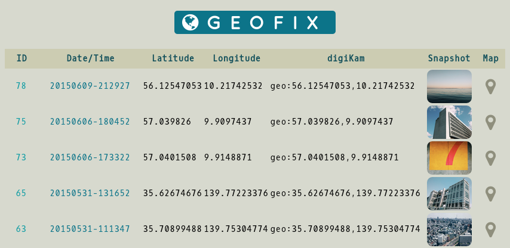

#About Geofix

Geofix is a simple tool for recording geographical coordinates and taking accompanying photos using and Android device.

The Geofix tool is available as a [SL4A](https://code.google.com/p/android-scripting/) Python script and Bash shell script for use with the [Termux](http://termux.com/) app and the Termux:API add-on. Both scripts can be used to acquire geographical coordinates using either the network or GPS. The obtained data is then saved in a comma-separated text file and an SQLite database.

 The supplied Geofix web app makes it possible to access and view the recored data and photos.

## Requirements

- SL4A and Python for Android for Android 4.x.x or Termux with the Termux:API add-ón
- Python and Python Bottle (required for Geofix Web)
- Git (optional)

## Installation

Copy the *geofix.py* script to the *sl4a/scripts* directory on the Android device. Alternatively copy the *geofix.sh* Bash shell script in the desired location on the Android device.

## Usage

Open the SL4A app, and run the *geofix.py* script. For faster access, add the script to the homescreen. To run the *geofix.py* script, launch Termux, switch to the directory where *geofix.sh* is stored, then run the script using the `bash ./geofix.sh` command.

By default, all data is saved in the *Geofix* directory on the internal storage. You can change the destination directory by modifying the default *geofix_dir* path in the script.

## Geofix Web Installation

- Install the Python Package Manager (pip). On Debian and Ubuntu, this can be done by running the `apt-get install python-pip` command as root.
- Install pip. To do this on Debian and Ubuntu, run the `pip install bottle` as root.
- Clone the project's GitHub repository using the `git clone https://github.com/dmpop/geofix.git` command. Alternatively, grab the latest source code from the project's GitHub repository and unpack the downloaded ZIP archive.
- Copy the *Geofix* directory containing the *geofix.sqlite* database and snapshots from the Android device to the *geofix-web/static* directory.
- Switch to the *geofix-web* directory and run `./main.py` to start the app. Point the browser to http://127.0.0.1:8381/geofix to access it.

## License

This program is free software: you can redistribute it and/or modify it under the terms of the GNU General Public License as published by the Free Software Foundation, either version 3 of the License, or (at your option) any later version.

This program is distributed in the hope that it will be useful, but WITHOUT ANY WARRANTY; without even the implied warranty of MERCHANTABILITY or FITNESS FOR A PARTICULAR PURPOSE.  See the GNU General Public License for more details.

You should have received a copy of the GNU General Public License along with this program.  If not, see <http://www.gnu.org/licenses/>.
